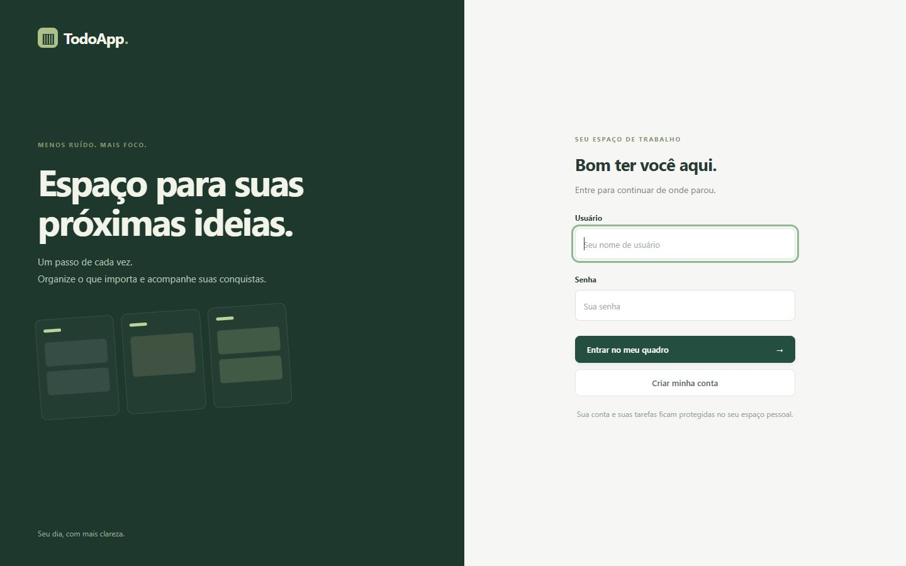
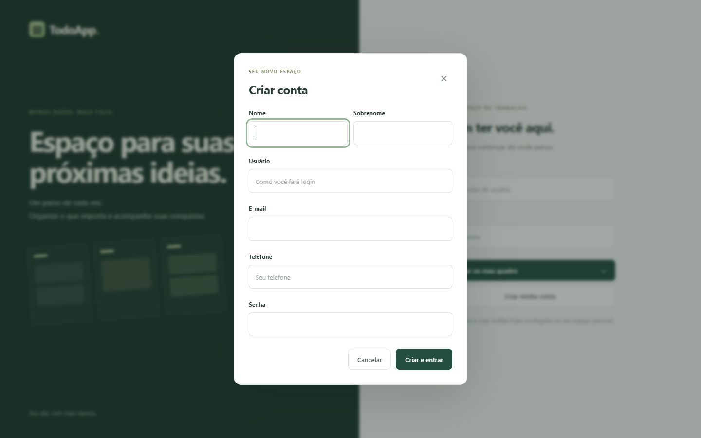
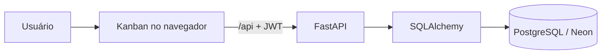

# TodoApp — Kanban com FastAPI

Aplicação full stack para organizar tarefas pessoais em um quadro Kanban. O projeto combina uma API FastAPI com autenticação JWT, um frontend responsivo em JavaScript e persistência PostgreSQL.

[](https://fastapi-projetos.onrender.com)
[](https://fastapi.tiangolo.com/)
[](https://www.python.org/)

> **Projeto publicado:** [fastapi-projetos.onrender.com](https://fastapi-projetos.onrender.com)  
> No plano gratuito, a primeira abertura após um período sem uso pode levar alguns segundos.



## O que a aplicação oferece

- Cadastro de conta e login com JWT Bearer.
- Quadro com as colunas **A fazer**, **Em andamento** e **Concluído**.
- Criação, edição e exclusão de tarefas.
- Alteração de status por arrastar e soltar ou pelo seletor do card.
- Prioridades de 1 a 5, pesquisa e indicador de progresso.
- Isolamento das tarefas por usuário.
- Sessão com expiração, logout e tratamento de erros.
- API documentada com Swagger UI e ReDoc.
- Rotas administrativas protegidas por papel.

### Cadastro integrado

O cadastro público sempre cria uma conta comum. O papel do usuário é definido no servidor e não pode ser elevado pelo formulário.



## Tecnologias

| Camada | Tecnologias |
| --- | --- |
| Frontend | HTML, CSS e JavaScript ES Modules |
| API | Python, FastAPI e Uvicorn |
| Autenticação | OAuth2 Password, JWT, passlib e bcrypt |
| Persistência | SQLAlchemy, PostgreSQL e SQLite local |
| Validação | Pydantic |
| Migrações | Alembic |
| Hospedagem | Render e Neon Postgres |
| Testes | Pytest, unittest e Node Test Runner |

## Arquitetura



Em produção, o mesmo serviço entrega o frontend em `/` e monta a API em `/api`. Segredos como a chave JWT e a URL do banco ficam nas variáveis de ambiente da hospedagem.

## Executar localmente

### 1. Preparar o ambiente

```bash
git clone https://github.com/onunis/FastApi-Projetos.git
cd FastApi-Projetos
python -m venv .venv
```

Windows PowerShell:

```powershell
.\.venv\Scripts\Activate.ps1
python -m pip install -r requirements.txt
```

Linux ou macOS:

```bash
source .venv/bin/activate
python -m pip install -r requirements.txt
```

### 2. Configurar o backend

Crie `TodoApp/.env`:

```dotenv
SQLALCHEMY_URL=sqlite:///./todos.db
SECRET_KEY=troque-por-uma-chave-local-longa-e-aleatoria
```

O `.env` e os bancos SQLite locais não são versionados.

### 3. Iniciar a API

```bash
cd TodoApp
python -m uvicorn main:app --reload
```

A API ficará em `http://127.0.0.1:8000`.

### 4. Iniciar o frontend

Em outro terminal, a partir da raiz do repositório:

```bash
cd TodoApp/frontend
node server.mjs
```

Abra [http://127.0.0.1:5173](http://127.0.0.1:5173). O servidor local encaminha apenas as rotas necessárias para a API em `http://127.0.0.1:8000`.

## Endpoints principais

As rotas abaixo aparecem sem o prefixo de produção. Na aplicação publicada, use `/api` antes da rota.

| Método | Rota | Finalidade | Acesso |
| --- | --- | --- | --- |
| `POST` | `/auth/` | Cadastrar usuário comum | Público |
| `POST` | `/auth/token` | Obter token JWT | Público |
| `GET` | `/` | Listar tarefas próprias | Autenticado |
| `GET` | `/todo/{id}` | Consultar uma tarefa | Proprietário |
| `POST` | `/todo` | Criar tarefa | Autenticado |
| `PUT` | `/todo/{id}` | Editar título, descrição e prioridade | Proprietário |
| `PATCH` | `/todo/{id}/status` | Mover entre colunas | Proprietário |
| `DELETE` | `/todo/{id}` | Excluir tarefa | Proprietário |
| `GET` | `/users/` | Consultar perfil | Autenticado |
| `PUT` | `/users/password` | Alterar senha | Autenticado |
| `PUT` | `/users/phone_number/{phone_number}` | Atualizar telefone | Autenticado |
| `GET` | `/admin/todo` | Listar todas as tarefas | Administrador |
| `DELETE` | `/admin/todo/{id}` | Excluir qualquer tarefa | Administrador |

Documentação interativa:

- Local: [Swagger UI](http://127.0.0.1:8000/docs) e [ReDoc](http://127.0.0.1:8000/redoc)
- Produção: [Swagger UI](https://fastapi-projetos.onrender.com/api/docs) e [ReDoc](https://fastapi-projetos.onrender.com/api/redoc)

## Estrutura do projeto

```text
FastApi-Projetos/
├── README.md
├── requirements.txt
├── RENDER.md
├── deployment_tests/
└── TodoApp/
    ├── main.py
    ├── hosting.py
    ├── database.py
    ├── models.py
    ├── routers/
    │   ├── auth.py
    │   ├── todos.py
    │   ├── users.py
    │   └── admin.py
    ├── frontend/
    │   ├── index.html
    │   ├── styles.css
    │   ├── register.css
    │   ├── app.js
    │   ├── api.js
    │   ├── server.mjs
    │   └── tests/
    ├── alembic/
    └── test/
```

## Testes

Backend:

```bash
python -m pytest TodoApp/test
```

Frontend:

```bash
node --test TodoApp/frontend/tests/api.test.mjs
```

Entrada de hospedagem e fluxo integrado, usando banco isolado em memória:

```bash
python -m unittest discover -s deployment_tests
```

Os testes cobrem autenticação, autorização, isolamento entre usuários, contratos das tarefas, cadastro seguro, proxy local e o fluxo integrado da versão hospedada.

## Publicação

A versão online utiliza:

- um Web Service gratuito na Render;
- PostgreSQL gratuito no Neon;
- `SQLALCHEMY_URL` e `SECRET_KEY` configuradas apenas como variáveis protegidas;
- criação automática do esquema somente quando o banco online está completamente vazio;
- validação do esquema nas inicializações seguintes, sem excluir dados.

As instruções operacionais estão em [RENDER.md](RENDER.md).

## Contexto

O backend começou como projeto do curso **FastAPI — The Complete Course 2026**, de Eric Roby e Chad Darby, e evoluiu com testes de segurança, status de tarefas, frontend Kanban e publicação completa.

## Autor

Desenvolvido por [Guilherme Nunes](https://github.com/onunis) como projeto de estudo em Python, APIs e desenvolvimento full stack.
